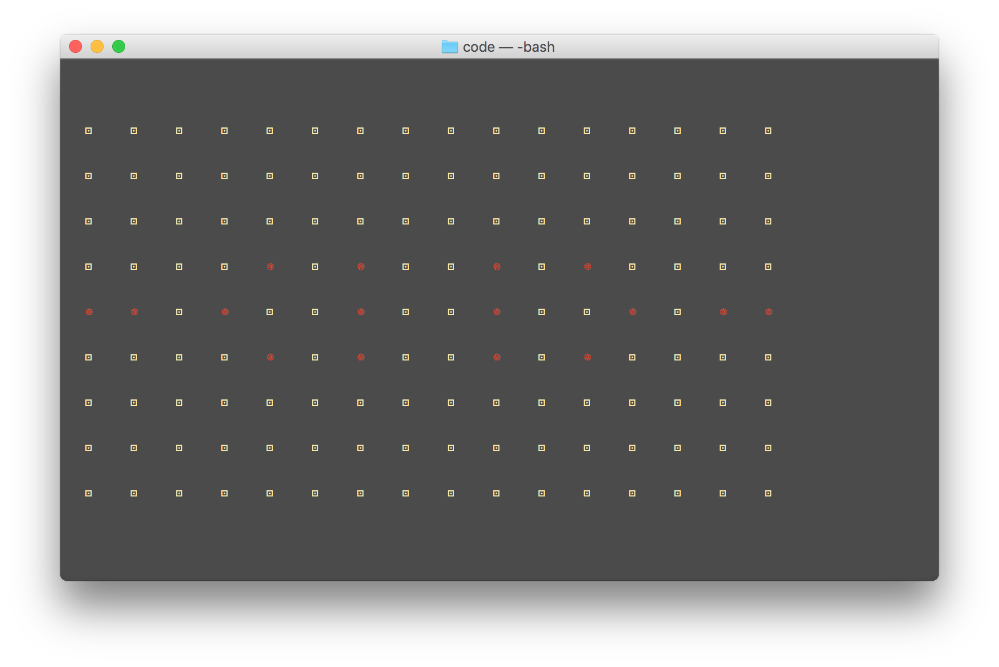

# GameOfLife
This is a simple implementation of the [Conway's Game of Life](https://en.wikipedia.org/wiki/Conway%27s_Game_of_Life) for the Terminal.

It has been coded in Java.  
Furthermore, Ant has been used to build and run the program. Also it can build the Javadoc and clean the created files.
 
---
Here is one of the fifteen states of a **_Pentadecathlon_**.

